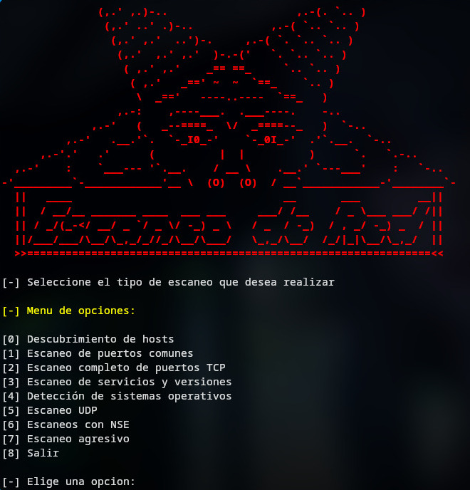

# nmap_manager
Script para realizar auditorias de seguridad de reda a traves de Nmap de manera organizada, desglosando la informacion segun lo que necesite el usuario.


## Menu de opciones
Este script esta equipado con una variedad de opciones para poder realizar una auditoria de seguridada de red completa, ademas que almacena la informacion
en una carpeta de manera organizada, asi el usuario facilmente puede consultar la informacion despues de la auditoria.

## Instalacion
Ejecuta en tu terminal:
```bash
git clone https://github.com/whoamijas0n/nmap_manager
cd nmap_manager
sudo bash nmap_manager.sh
```
Para volver a utilizar el script simplemente vuelve a ejecutar:
```bash
sudo bash nmap_manager.sh
```
Asegurate de siempre iniciar este script con permisos de root
## Dependencias
Puedes instalar las dependencias desde el menu de el script.

## Avisos
El script esta abierto a mejoras, si deseas hacerme llegar una recomendacion o hay un error puedes enviarme un correo a jasonadonayv@gmail.com
